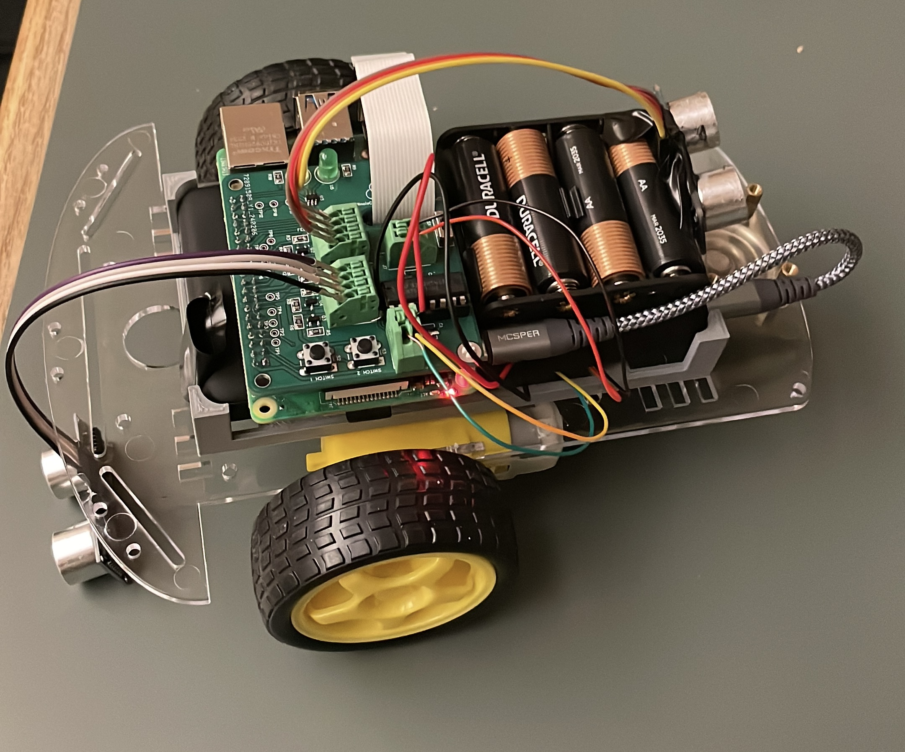

# RunningOutOfTime
Having trouble waking up in the morning? Hitting snooze? What if your alarm was always too far to snooze? This autonomous car will make sure you'll never be close enough to hit that snooze button.

## Basic Information:
### Inspiration
Our roommate rarely wakes up on time. As fellow concerned roommates, we realized the dire need to design a more effective alarm clock to save his academic career. With one more cs374 midterm to go, we can still change his life.
### What it does
This mobile alarm clock ensures you have a hard time turning it off. While the alarm goes off and it detects a person coming up to it, the vehicle simply drives away from you, forcing you to get out of bed and chase it down.
### How we built it
We built an autonomous car by running through a Raspberry Pi 4. We utilized a camera with a machine learning model to recognize faces to tell when you're approaching it. We were also going to use the provided sensors to help with object avoidance, but we ran into a slight problem which we'll expand on in the next section. The raspberry pi and camera are powered with a larger battery pack connected through usb-c, and the motors are powered by a smaller battery with its leads directly connected to the H-bridge. As of right now, the car is always active so you can simply place your phone in the slot after setting your alarm. 
### Challenges we ran into
During the process, we accidentally ripped the micro-usb connector off our pi hat. With no knowledge of how the hardware behind pi's work, we spent hours searching different solutions, eventually utilizing the solution told by the folks at John Deere. We also accidentally fried _both_ our ultrasonic sensors.  
### Accomplishments that we're proud of
As 4 CS majors who have never connected wires, let alone build a vehicle, the entire hardware process was completely foreign to us. Despite spending 20 minutes thinking the battery holder was the chassis, we eventually worked our way towards a functioning vehicle. Even though the project didn't reach what we had originally hoped for, we overcame a variety of novel hardware challenges that we are very proud of.

